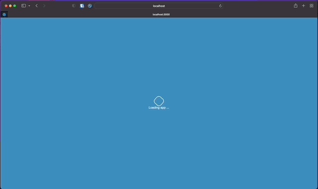

# Analysis of Airbnb listings

## Introduction



Airbnb Analysis Dashboard is a web application that provides an interactive dashboard containing visualizations and summaries to gain insights about Airbnb using the Airbnb dataset for the USA.

Application is live at:

- **Web Application**: [https://sajalshres.shinyapps.io/airbnb-analysis/](https://sajalshres.shinyapps.io/airbnb-analysis/)

- **API Application**: [api-airbnb.sajalshres.com](https://api-airbnb.sajalshres.com/__docs__/). Visit `/__docs__/` endpoint to view API documentation.

**Note:** API applicaiton is not hosted at the moment. Please refer to setup guide to run it locally.


## Proposal

Please visit [proposal document](./docs/proposal.md) for more details on proposal.

## Folder Structure

```
sta-518-project
|
|--api        # API application to fetch raw data, analaysis and summaries.
|--app        # Shiny web appliation containing interactive dashboard.
|--data       # Contains raw and processed data
|--docs       # Contains documentation and rmarkdown notebooks.
|--etl        # ETL cli application to scrape and process the data for analysis.
|--modules    # Shared modules used by scripts and applications.
|--scripts    # Contains rscripts.
```

## Setup

1. Install required packages

  ```bash
  Rscript scripts/setup.R
  ```

2. Run etl cli tool to scrape the raw data and process them.

  ```bash
  Rscript etl/main.R
  ```
  
3. Run web application

  ```bash
  Rscipt scripts/start_app.R --app-dir app --host 127.0.0.1 --port 3000
  ```

4. Run api application

  ```bash
  Rscript scripts/start_api.R --app-dir app
  ```
5. Launch your favorite browser and visit `http://localhost:3000` to view web application.

<p align="center">
  
</p>


6. Launch your favorite browser and visit `http://localhost:8000/__docs__/` to view api application.

<p align="center">
  
</p>

If you wish to use Docker, please check out [Setup with Docker](./docs/docker.md)

