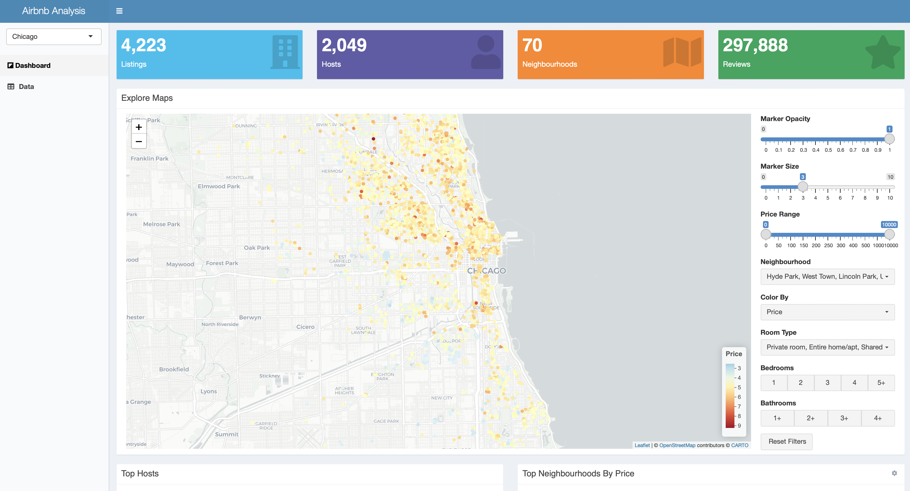

# Setup using Docker


## Requirements

- [docker](https://docs.docker.com/engine/install/)

- [docker-compose](https://docs.docker.com/compose/install/)

## Steps

- Build docker images and wait for process to end

  ```bash
  $ docker-compose build
  ```

- Run images

  ```bash
  $ docker-compose up
  ```
- Launch your favorite browser and visit `http://localhost:3000` to view web application.

<p align="center">
  
</p>


- Launch your favorite browser and visit `http://localhost:8000/__docs__/` to view api application.

<p align="center">
  
</p>
